# :tv:  Video

# :computer:  Actividades

## Pruebas con Postman

### Antes de empezar :exclamation::exclamation:
*Nota: Necesitamos tener postman instalado, lo podemos obtener aqui*

``` 
https://www.postman.com/downloads/
```

### 1. Importamos la coleccion que esta en formato json en este repositorio

```
Archivo -> Importar -> Seleccionamos el archivo
```

### 2. Ambientes

Postman soporta ambientes diferentes, así como un flujo de desarrollo. Dichos ambientes se pueden crear ya sea haciendo click en el selector de la izquierda, debajo de las opciones de *Colections* y *APIS*:

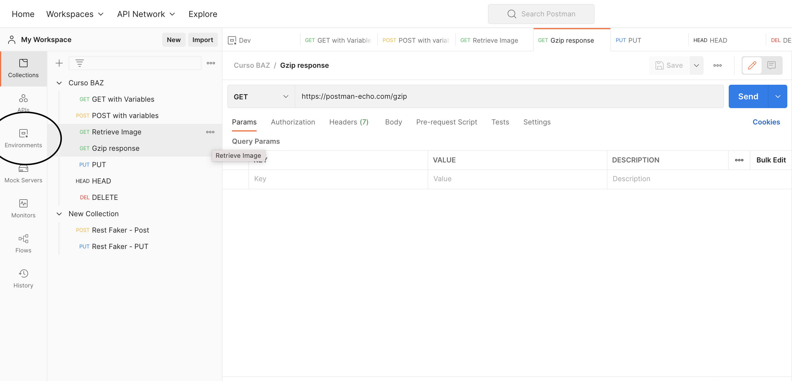

O en el botón de Environment quick lookup a la derecha de la interfaz

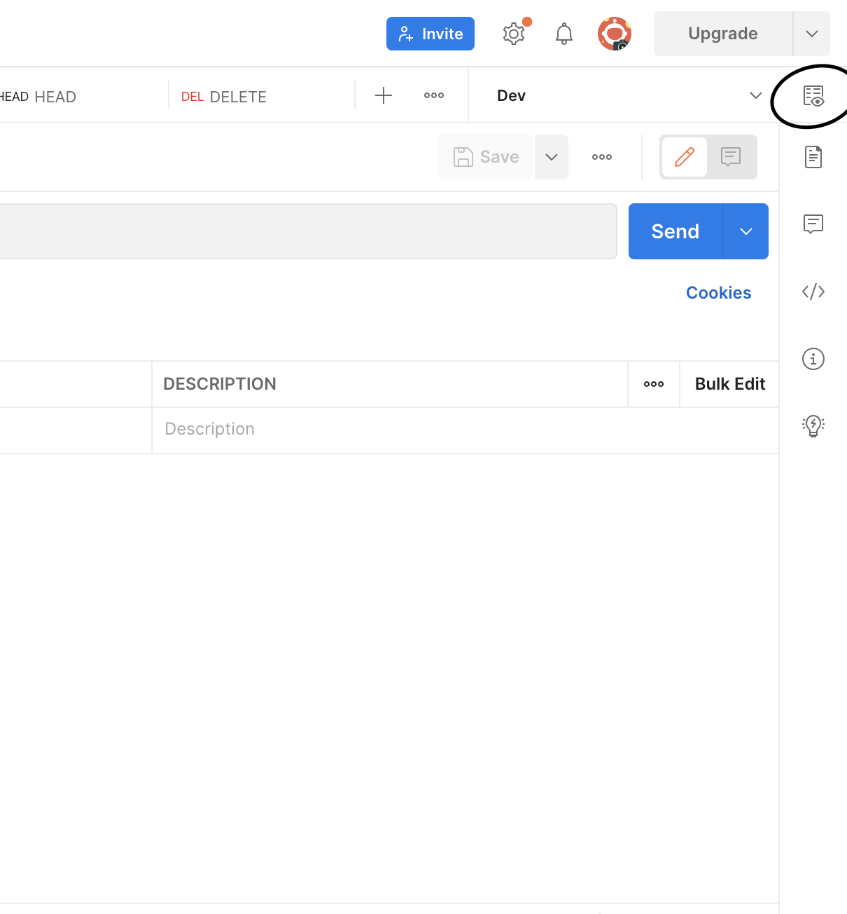

### 3. Variables globales

Estas variables son elementos que no cambiarán a pesar de que se cambie el ambiente en el que se está trabajando, se pueden crear en las mismas opciones que en la creacion de ambientes.

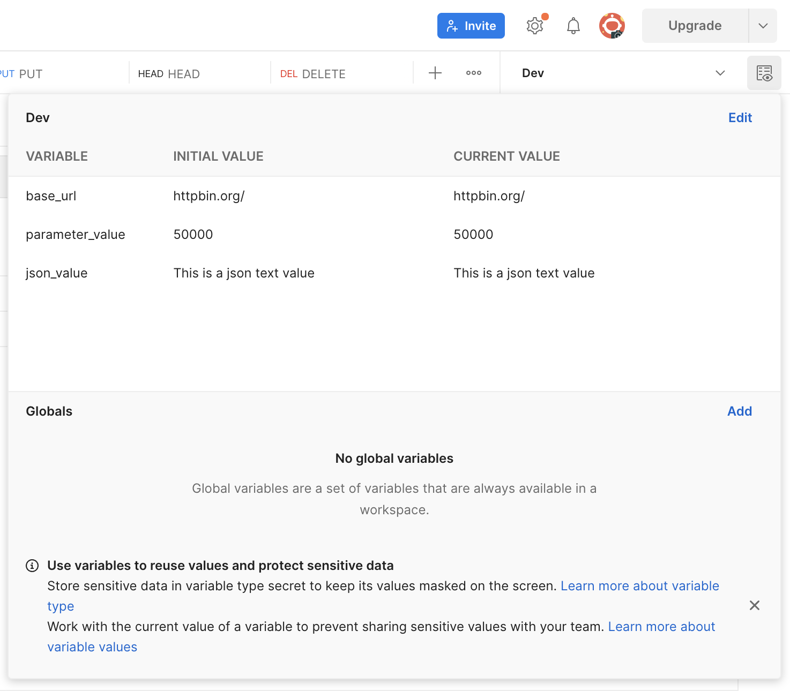

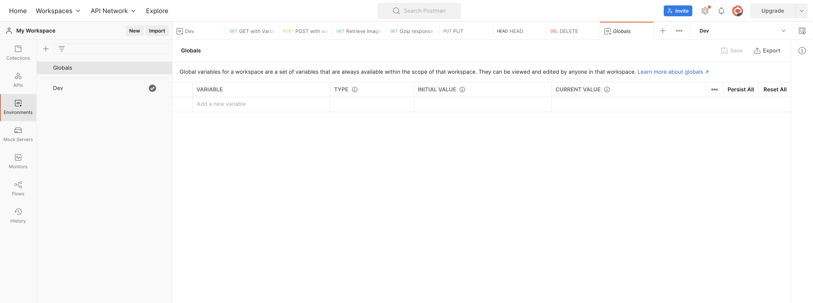

### 4. Variables de ambiente.

Estas variables son aquellas cuyos valores queremos que cambien de acuerdo al ambiente en el que trabajemos, las crearemos seleccionando el ambiente en el que queremos que sean creadas y agregandolas a la tabla que nos presenta la interfaz:

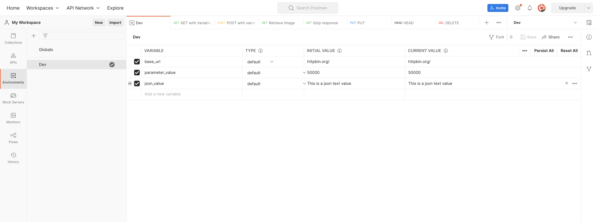

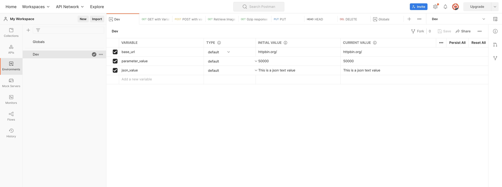

### 4. HTTP GET 

La primera llamada que visitaremos es GET. Esta request es una sencilla llamada get, las llamadas get están diseñadas para recuperar un recurso del servidor. Como podemos observar está compuesta por diferentes elementos, una url para la solicitud, cabecera de la missma, parametros de url.
Los parametros de URL son los elementos que aparecen en la url después del signo de interrogacion, en este caso especifico en el parametro a usar se llama *somevariable* y su valor corresponde al valor de la variable de ambiente *parameterValue*.
De la misma forma podemos cambiar la definición del valor del parametro por un valor explícito, simplemente remueve los simbolos **{}** y coloca cualquier valor. Envia el request y observa la respuesta:


Como puedes observar este servidor de prueba solamente nos devuelve la información de la misma llamada, en el elemento args podemos ver cuales son los parametros de URL que enviamos. 
Te animo a que agregues parametros adicionales al request y observes como este elemento cambia de acuerdo a lo que estamos enviando. 
Así mismo podemos ver los valores de los headers que nosotros enviamos en POSTMAN se ven reflejados en el elemento *headers*, *origin* nos indica cual es la IP que hizo la llamada y url es el recurso solicitado.
Puedes verificar esta informacion haciendo click en la pestaña headers en postman, justo debajo del elemento url.

### 5. HTTP HEAD

A continuacion veremos la llamada HEAD. Puedes solamente cambiar el tipo de llamada en la lista a la izquierda de la url a solicitar o abrir la llamada HEAD en la coleccion. Esta llamada tiene la particularidad de que nunca nos resolverá un elemento 
*body* en la respuesta, solamente los headers que el servidor devuelve. En la parte inferior da click en la pestaña headers para verificar el contenido

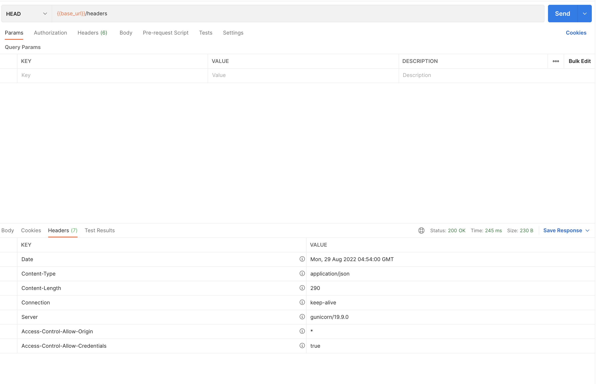

### 6. HTTP POST

La siguiente llamada es un POST. El objetivo de está llamada es poder proporcionar información adicional (y más compleha) al servidor de una manera relativamente más segura que en un GET, post soporta varios tipos de datos en el cuerpo de la solicitud, como lo es *json, xml, texto plano, imagenes, etc*
La informacion de esta manera viaja como parte del cuerpo de la llamada y en postman esta puede ser modificada en la pestaña *body* en la parte de request: En este ejemplo podemos abrir la llamada 
Post with variables en la colección proporcionada. Como podemos observar la llamada contiene un objeto de tipo json en el cual solamente tenemos un elemento, cuyo valor también está determinado por una variable de ambiente. Ejecutemos la llamada para conocer su resultado:

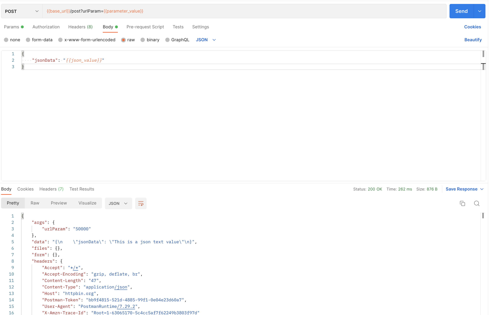

De la misma manera podemos ver como, en el contenido de la respuesta, tenemos un elemento llamado data, el cual contiene la informacion que le proporcionamos al servidor como parte de la llamada original http
A su vez tenemos elementos que *form* y *files*, los cuales están vacios para esta primera llamada, pero los cuales podemos proporcionar en la pestaña body, cambiando el selector a form o binary, segun prefiramos, por ejemplo:

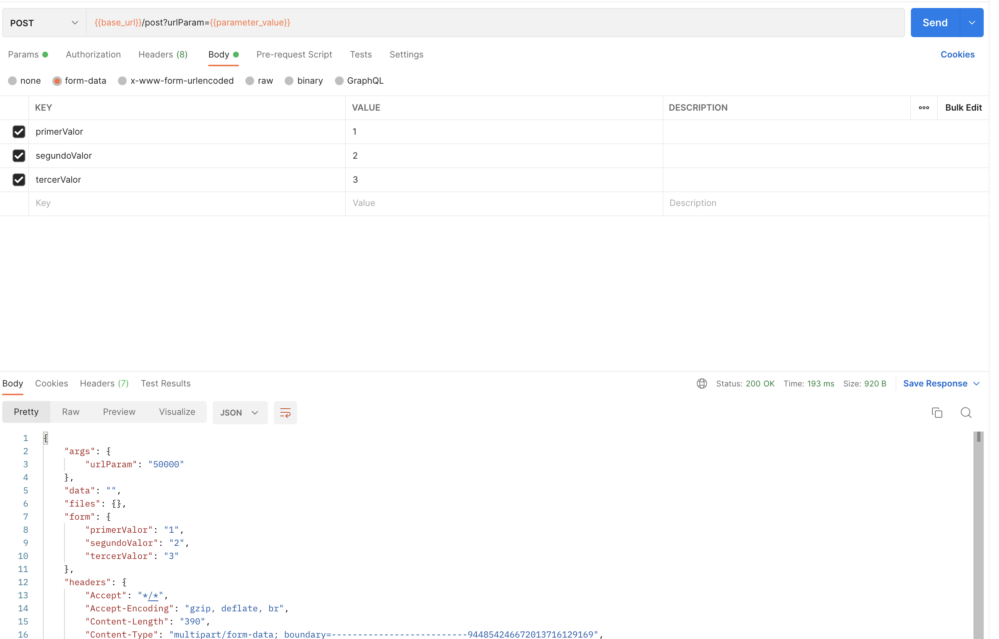

### 8. HTTP PUT

El proposito de put es proporcionar el estado actual de algun recurso del servidor, ya sea para actualizar el mismo o para validar el estado de tal. Actualmente la convención es que se usa para actualizar elementos, como si fuera un update al recurso. En la practica funciona basicamente de
la misma manera que una llamada post. Puedes comprobar su comportamiento abriendo y ejecutando la llamada PUT en la colección. Nuevamente te invito a que modifiques elementos del body o de los parametros de url y notes los cambios en la respuesta.

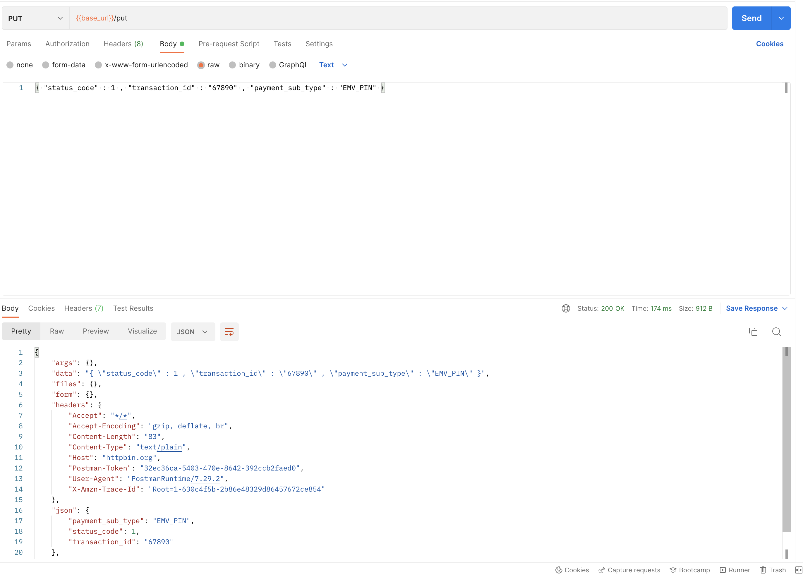

### 9. HTTP Delete

Esta llamada tiene como proposito eliminar un recurso del servidor, acepta un request body. Podemos abrir la llamada DELETE en la coleccion y comprobar su comportamiento. En este caso los recursos no serán eliminados ya que son un recurso externo y con propositos de prueba y educativos, pero en el 
desarrollo real lo ideal es que se encargue de la eliminacion de elementos de los sistemas:

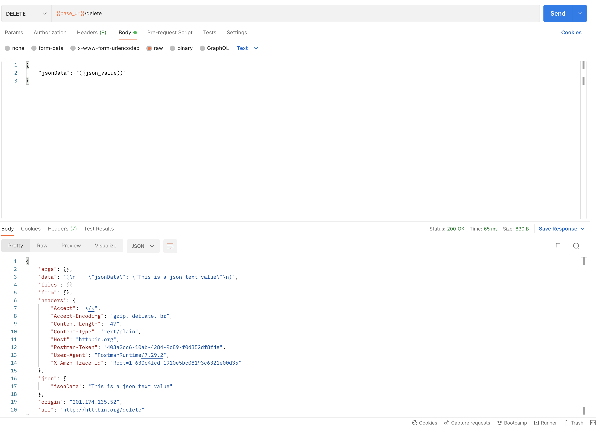

Estos son los metodos http mas comunmente usados, si quieres saber informacion adicional por favor consulta la bibliografia al final de este documento

### 10. Respuestas comprimidas 

Postman es capaz de manejar respuestas de servidor que han sido comprimidas previo a su envio, como ejemplo de esto podemos abrir la llamada Gzip response que es parte de la colección proporcionada. Probemos a ejecutarla en postman y veamos el resultado:

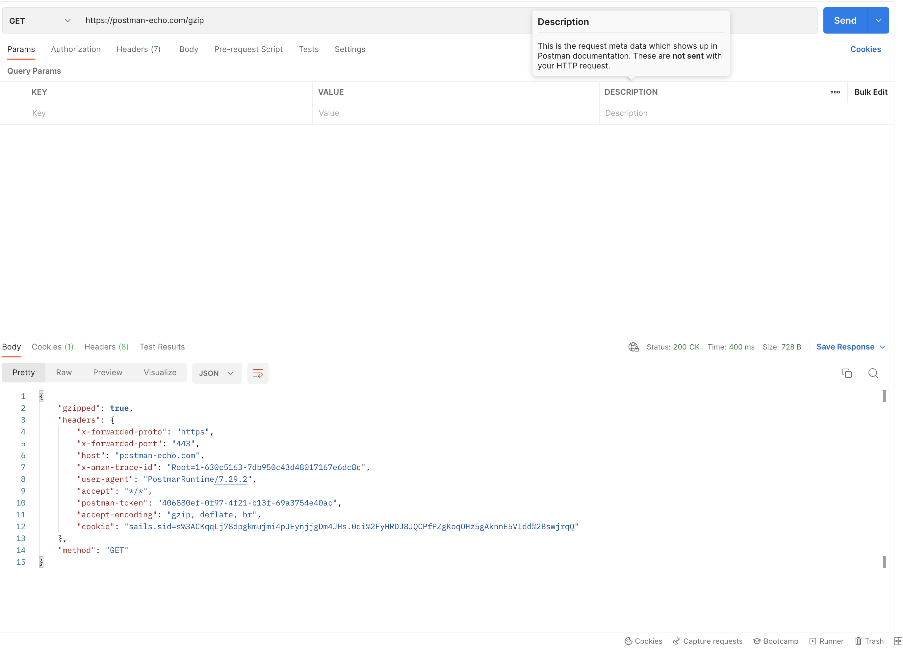

Como podemos observar parece una respuesta común y corriente, pero si observamos con atención en los headers, podemos observar que el header *Content-Encoding* nos dice que la respuesta está codificada como un archivo gzip. 
Por ejemplo, podemos observar está misma llamada como un curl:

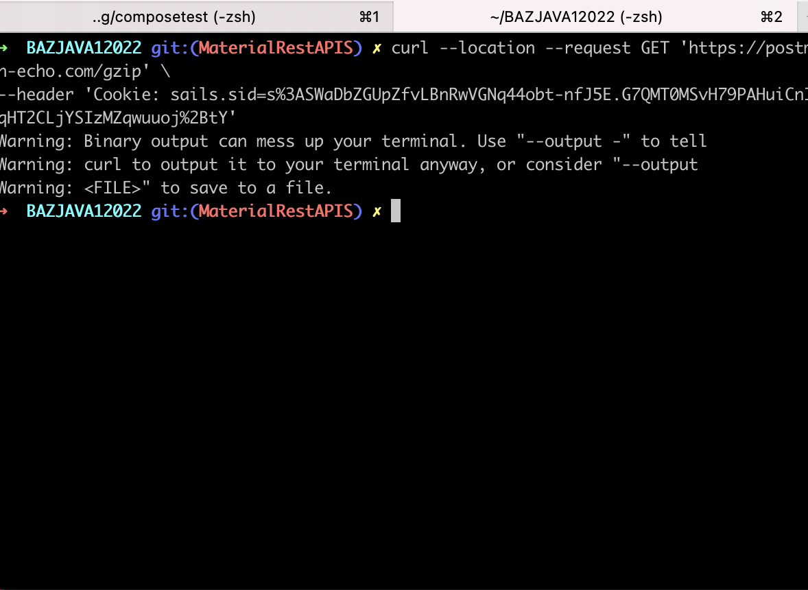

En este caso curl en la terminal nos advertira que este tipo de respuesta puede causar errores en la salida de la terminal. agregamos el parametro --output a curl para forzar que nos muestre la respuesta a pesar del riesgo:

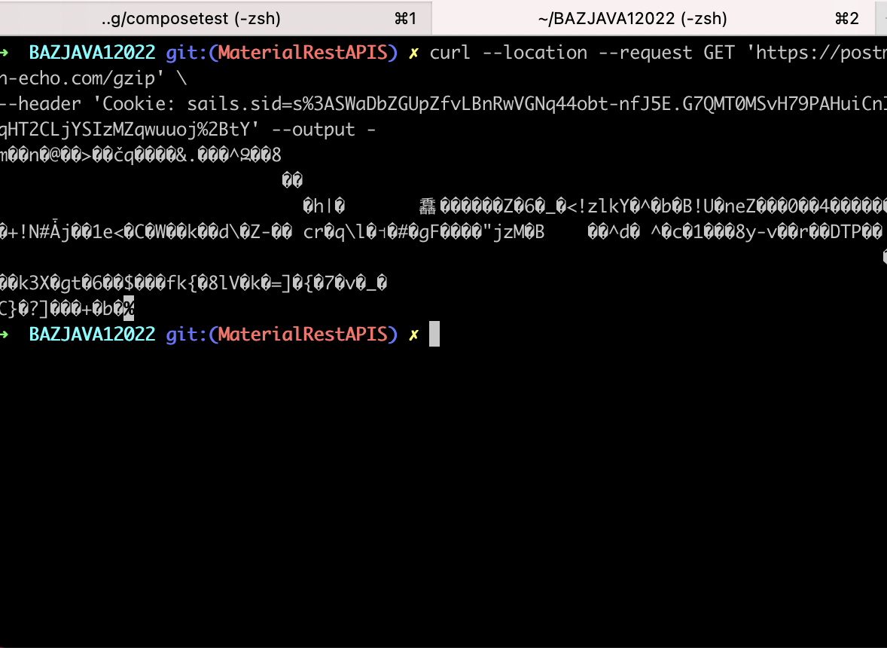

### Desafio para recordar el tema anterior

El desafio es agregar el servicio de httpbin al docker-compose que creamos en la sesión anterior y envia algunas peticiones al servidor local que se ha creado en dicho contenedor

# :books: Para aprender mas
* https://httpbin.org/
* https://learning.postman.com/docs/getting-started/introduction/
* https://developer.mozilla.org/es/docs/Web/HTTP/Basics_of_HTTP/MIME_types
* https://developer.mozilla.org/es/docs/Web/HTTP/Methods
* https://www.redhat.com/es/topics/integration/whats-the-difference-between-soap-rest