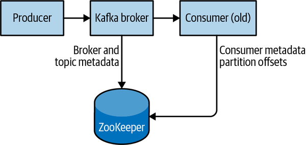

# Kafka 101
Recursos y pasos importantes para el curso

## Antes del curso
Es importante que antes del curso se estudie por cuenta propia los siguientes recursos:
* [Setup](https://kafka.apache.org/quickstart) (Para la instalación es importante ver la sección **Antes de empezar**)
* [What is Kafka?](https://www.confluent.io/what-is-apache-kafka/) | [What is Apache Kafka?](https://www.geeksforgeeks.org/what-is-apache-kafka-and-how-does-it-work/?ref=rp)
* [Topics, partitions and offsets](https://medium.com/event-driven-utopia/understanding-kafka-topic-partitions-ae40f80552e8) 

# :computer:  Actividades

## Antes de empezar :exclamation:
Para realizar este curso es importante tener instalado los siguientes programas:

- Java > 8
- Kafka (https://kafka.apache.org/quickstart)
- Tener un IDE instalado como [Visual Studio Code](https://code.visualstudio.com/download) o [IntelliJ](https://www.jetbrains.com/idea/download) 
- Maven

Para la instalación en Windows seguir el siguiente video:

https://youtu.be/aKDWWICgfA0 (en)
https://youtu.be/u5THXLlW0tU (es)


## Kafka CLI (Command Line Interface) 101
Una vez que Kafka fue descargado e instalado, procederemos a validar que este bien instalado para comenzar las pruebas

### PASO 1: Iniciar ZooKeeper service y Kafka Server
Abrimos una terminal y nos movemos al directorio donde se descargo Kafka 
(ej. C:/Downloads/kafka_2.13-3.2.1)

``` bash
# Iniciamos Zookeeper (Zookeeper sera nuestra herramienta aunada a Kafka para mantener los logs/mensajes guardados)

bin/zookeeper-server-start.sh config/zookeeper.properties 

# para Windows  
.\bin\windows\zookeeper-server-start.bat .\config\zookeeper.properties

# si todo funciona bien, nos saldra un log parecido a 
# INFO binding to port 0.0.0.0/0.0.0.0:2181 (org.apache.zookeeper...)
# En caso de falla, usualmente es porque el puerto 2181 esta ocupado y debemos cambiar el puerto editando el archivo de zookeeper.properties y modificando el puerto
```

Luego abrimos una segunda terminal, y nos movemos de nuevo al directorio de kafka
```bash
# Inicializamos el server de kafka con el comando
bin/kafka-server-start.sh config/server.properties

# para Windows
.\bin\windows\zookeeper-server-start.bat .\config\server.properties
# si se inicializa bien veremos el log 
# INFO [KafkaServer id=0] started (kafka.server....)
``` 

### PASO 2: Crear un TOPIC para guardar los eventos
Actualmente tenemos corriendo dos servicios, Zookeeper que trabaja de la mano de Kafka para guardar los logs (como si fuera nuestra Base de datos) y el server de Kafka

Ahora en una tercera terminal hacemos lo siguiente
```bash
bin/kafka-topics.sh --create --topic <topic-name> --bootstrap-server localhost:<kafka-server-port>
# el puerto base para el server de kafka suele ser el 9092

# para Windows
.\bin\windows\kafka-topics.bat --create --topic <topic-name> --bootstrap-server localhost:<kafka-server-port>
# .\bin\windows\kafka-topics.bat --create --topic topic_demo --bootstrap-server localhost:9092
```
Al crear el TOPIC nos saldra un log similar a:
`Created topic <topic-name>`

### PASO 3: Escribir eventos en el TOPIC

```bash
bin/kafka-console-producer.sh --topic <topic-name> --bootstrap-server localhost:<kafka-server-port> 
> <type-data>
> <type-data>
> <type-data>

# para Windows
.\bin\windows\kafka-console-producer.bat --topic <topic-name> --bootstrap-server localhost:<kafka-server-port> 
> <data>
> <data>
> <data>
```
(No cerrar la terminal de este paso)

### PASO 4: Leer los eventos del TOPIC
Abrimos una terminal nueva (sin cerrar la terminal del paso 3)
```bash
bin/kafka-console-consumer.sh --topic <topic-name> --bootstrap-server localhost:<kafka-server-port> 

# para Windows
.\bin\windows\kafka-console-consumer.bat --topic <topic-name> --bootstrap-server localhost:<kafka-server-port> 
```

Añadir la flag `--from-beginning` despues del nombre del topic
```bash
.\bin\windows\kafka-console-consumer.bat --topic <topic-name> --from-beginning --bootstrap-server localhost:<kafka-server-port> 
```




### Practica
La practica y ejercicios las podemos encontrar en el directorio de practica


# :books: Para aprender mas
* Kafka: The Definite Guide, 2nd Edition | O'Reilly Media
* https://kafka.apache.org/
* https://developer.confluent.io/learn-kafka/
* https://www.pluralsight.com/courses/apache-kafka-getting-started
* [Aprendiendo Apache Kafka Pt 1](https://www.enmilocalfunciona.io/aprendiendo-apache-kafka-parte-1/)
* [Aprendiendo Apache Kafka Pt 2](https://www.enmilocalfunciona.io/aprendiendo-apache-kafka-parte-2-2/)
* [Aprendiendo Apache Kafka Pt 4 - Instalación](https://www.enmilocalfunciona.io/aprendiendo-apache-kafka-parte-4/)
